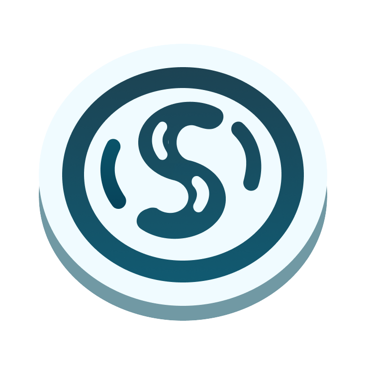
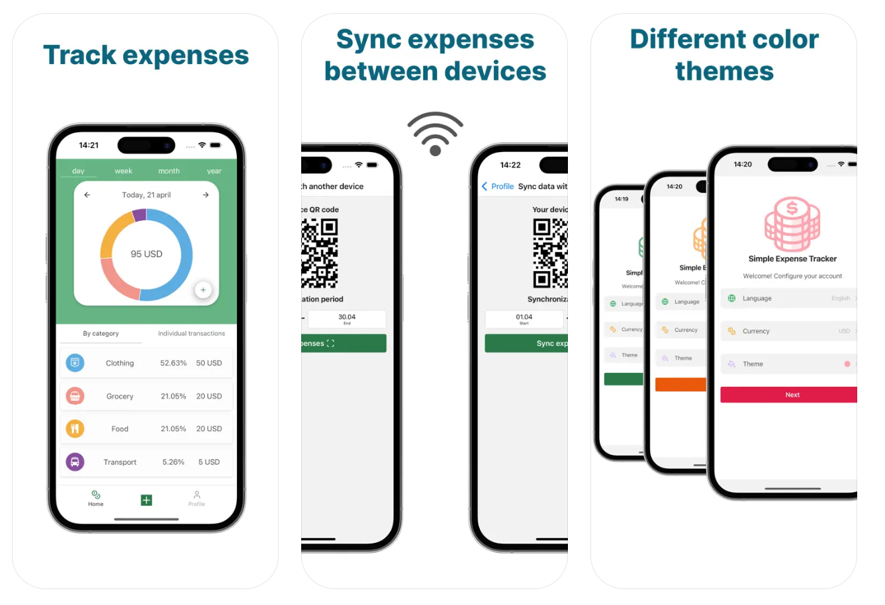

    
    <h1 align="center">Yet Another Expense Tracker</h1>

Welcome to the support page for **Yet Another Expense Tracker**, the easy-to-use app designed to help you effortlessly track your expenses across all your devices.

# Features

- **Track Expenses**: Categorize and record your expenses to get a clear overview of where your money goes, including detailed insights by category.
- **Synchronization**: Keep your data consistent across multiple devices with seamless synchronization over Wi-Fi network.
- **Customization**: Personalize your expense tracking experience with various color themes, and choose your preferred language and currency.

## How to Use

- **Adding Expenses**: Tap the "+" button on the home screen to add a new expense. Fill in the details and save.
- **Viewing Expenses**: View categorized expenses visualized through intuitive charts and lists.
- **Syncing Data**: To sync data between devices, navigate to the 'Profile' section and follow the instructions for syncing with another device.

## Feedback

We value your feedback! If you have suggestions or encounter any issues while using **Yet Another Expense Tracker**, let us know by submitting an issue on our [GitHub repository](https://github.com/creeston/yet-another-expense-tracker) or emailing us at **simpleexpensetrackerapp@gmail.com**.

## Contact Us

Need further assistance? Reach out to our support team at **simpleexpensetrackerapp@gmail.com**.

Thank you for choosing **Yet Another Expense Tracker**!
